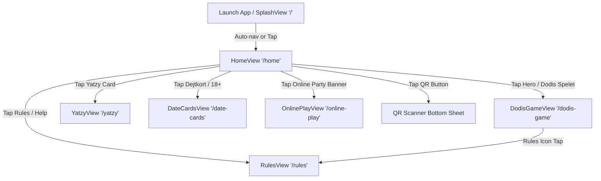
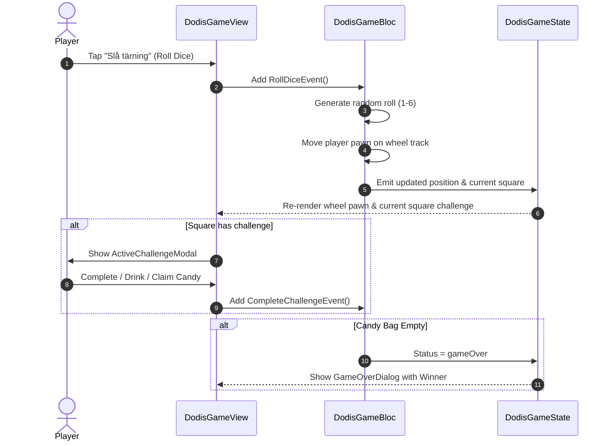

# 🔄 Application & User Flows

This document details the navigation paths, user flows, and state transition loops throughout the **Dodis Godis Mobile** app.

---

## 🗺️ High-Level Navigation Graph

---

## 🕹️ Game Loops & Specific Flows

### 1. App Startup Flow
1. **Bootstrap (`main.dart`)**:
   - `WidgetsFlutterBinding.ensureInitialized()`
   - `initDependencies()` registers Blocs and singletons into `GetIt`.
   - Forces portrait orientation.
   - Wraps root in `ScreenUtilInit(designSize: Size(393, 852))`.
2. **Splash Screen (`/`)**:
   - `SplashAnimationService` drives custom bag entrance, candy floaters, and logo fade.
   - Triggering tap or completion dispatches `SplashCompleted` → routes to `/home` via `context.go(Routes.home)`.

---

### 2. Dodis Godis Board Game Loop (`/dodis-game`)

---

### 3. Yatzy Flow (`/yatzy`)
1. **Turn Start**:
   - Current player starts with 3 rolls remaining.
2. **Rolling Dice**:
   - Tap "Kasta tärningar" → rolls all unheld dice.
   - Tap die item → toggles hold status (`ToggleHoldDieEvent`).
3. **Scoring**:
   - Select valid category in `YatzyProtocolTable`.
   - Score calculated and frozen for that player.
   - Turn rotates to next player; rolls reset to 3.

---

### 4. Date Cards Flow (`/date-cards`)
1. User filters card themes:
   - *Icebreaker* 🧊
   - *Fun* 🎉
   - *Deep* 💭
   - *Naughty (18+)* 🔥 (distinct shot challenge styling)
2. Tap "Nästa fråga" (Shuffle next card) or back button to review previous prompt.

---

### 5. Online Play & Screen Casting Flow (`/online-play`)
1. Room Code generated/displayed (`DODIS-7842`).
2. Toggle TV Mirroring:
   - Updates screen card state to show casting status.
3. Participant Roster displays active joined players with their score/drink tokens.
4. Party Camera toggle (`_cameraActive`).
