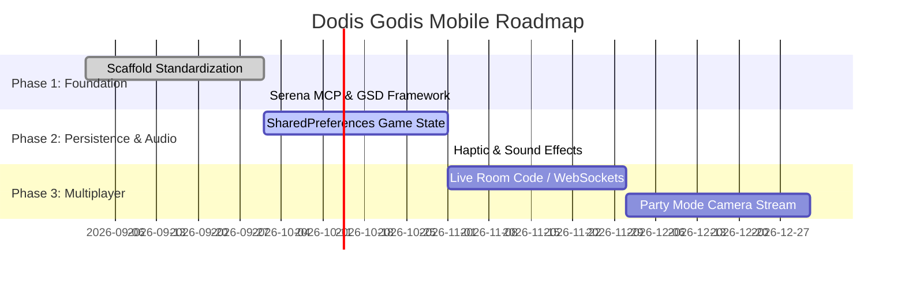

# 🗺️ Product & Engineering Roadmap

This roadmap outlines upcoming milestones, technical initiatives, and product goals for **Dodis Godis Mobile**.

---

## 🚀 Milestones Overview

---

## 📌 Phase 1: Foundation & Standardization (Completed ✅)
- [x] Responsive layout with `flutter_screenutil`.
- [x] Declarative routing with `go_router`.
- [x] State management architecture with `flutter_bloc`.
- [x] Replace all `Scaffold` occurrences with `AppCustomScaffold` (`safeBottom: true`).
- [x] Integrate Serena MCP configuration for IDE and agentic assistance.
- [x] Establish `.gsd` file-based state tracking system.

---

## ⚡ Phase 2: Offline Persistence & Polish (Next Up 🎯)
1. **Local State Persistence**:
   - Store active `DodisGameBloc` and `YatzyBloc` games in `shared_preferences` so accidental app closes do not lose game progress.
   - Add "Fortsätt spel" (Resume Game) prompt on Home screen.
2. **Haptic & Audio Effects**:
   - Dice rolling vibration + 3D roll audio.
   - Candy claim celebratory sound and particle explosion.
3. **Card Expansion**:
   - Additional 50+ Swedish party/date prompts for `DateCardsView`.

---

## 🌐 Phase 3: Connected & Party Multiplayer
1. **Real-time Synchronization**:
   - Connect `OnlinePlayView` with backend rooms (Supabase Realtime / WebSockets).
   - Sync wheel spins and scores in real-time across player devices.
2. **TV Casting**:
   - Web / Chromecast mirror client so players can watch the central board on television while controlling cards from their phones.
